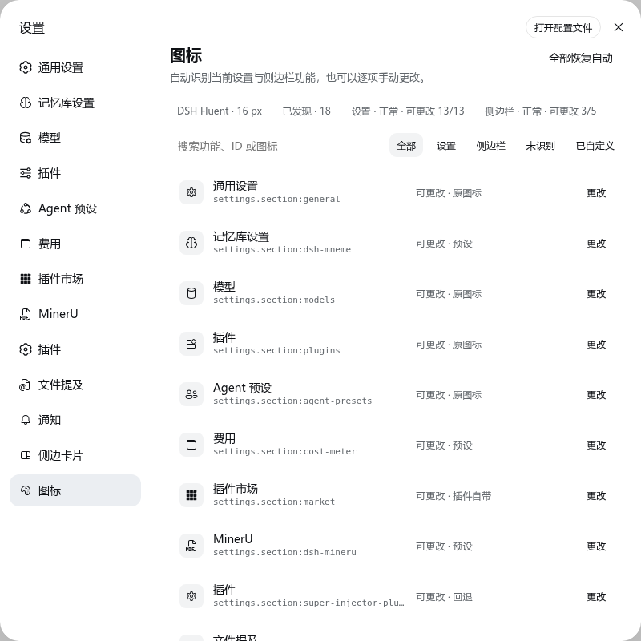
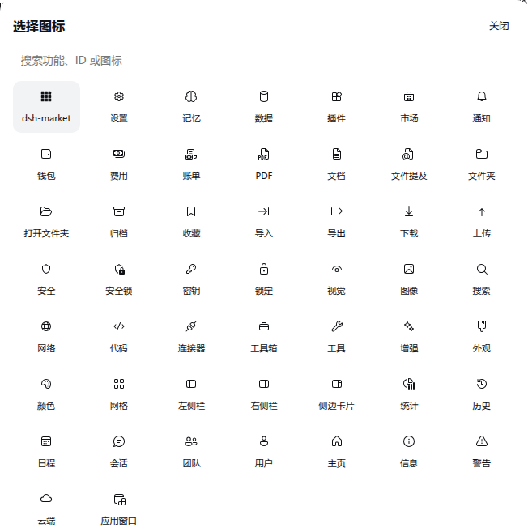

# dsh-icon-theme

[English](README.md) | 简体中文

为 DeepSeek Harness 的设置导航和侧边栏功能自动分配统一图标，并支持逐项手动更改。



## 为什么做这个插件

DSH 0.1.x 的设置贡献提供稳定 ID 和名称，但尚未提供图标字段，所以许多第三方页面都会回退成相同的齿轮。`dsh-icon-theme` 从实时插槽账本发现功能，优先保留可信原图标，用一套精简的 Fluent 风格图标补齐缺口，并允许用户覆盖每一项。

- 通用识别实时生效且经过优先级遮蔽后的 `settings.section` 和 `sidebar.footer.action`；只有侧边栏部分渲染、无法按顺序对应时，才使用经过审核的插件兼容记录。
- 用 `settings.section:market` 这样的稳定键保存选择，不依赖中文、英文或 DOM 顺序。
- 内置 50 个 Fluent UI 16 Regular 图标，以及经过审核的 dsh-market 单色原图标。
- 运行时不请求图标 CDN、Iconify、GitHub、webfont，也不扫描其他插件包。
- 卸载或热重载时完整恢复宿主 SVG 和插件添加的 DOM 标记。
- 明确区分“当前未渲染”和“非图标卡片”，不会假装已经更改成功。
- 目标既没有可信匹配、也没有原图标时，统一使用设置齿轮回退。

## 安装

```bash
dsh plugin --profile web add dsh-icon-theme
```

重启 `dsh web`，打开“设置 → 图标”。

从源码安装：

```bash
git clone https://github.com/yzke/dsh-icon-theme.git
cd dsh-icon-theme
npm ci
npm run build
dsh plugin --profile web add link:"$PWD"
```

兼容范围：DSH `>=0.1.0-rc.6 <0.2.0`。从源码构建需要 Node.js 22 或更高版本。

## 卸载

```bash
dsh plugin --profile web remove dsh-icon-theme
```

重启 `dsh web`。插件卸载时会恢复所有宿主 SVG，并移除自身添加的 DOM 标记和样式。

## 使用方式

图标页会列出所有已发现目标、稳定键、兼容状态和当前图标来源。可以按功能名、ID 或图标搜索，也可以筛选设置、侧边栏、未识别和已自定义项目；支持逐项选择、逐项恢复自动和全部恢复自动。



解析顺序固定为：

1. 用户手动覆盖。
2. 已审核并随包附带的插件原图标。
3. 可信的 DSH / 插件现有图标。
4. 稳定 ID 精确预设。
5. 稳定 ID 的无歧义语义推断。
6. 宿主已有回退图标；完全没有原图标时使用设置齿轮。

中英文名称只用于展示和搜索，不参与持久化映射。

## 侧边栏如何处理

| 状态 | 行为 |
| --- | --- |
| 已渲染的图标按钮 | 可以更改，默认优先保留原图标。 |
| 已注册但当前未渲染 | 显示“可预设”，出现时自动应用。 |
| 非图标卡片 | 明确报告，但不破坏卡片布局。 |
| 未知或结构变化的 DOM | 保持不动；只有唯一且经过审核的兼容记录才会匹配。 |

DSH 0.1.x 尚未提供公共图标解析接口，因此当前兼容层刻意保持范围小、可逆、遇到歧义就停。完整契约和上游建议见[设计文档](docs/design.md)。

同时安装 `dsh-better-sidebar` 时，其设置页自身图标会被视为可信原图标并默认保留；只有用户选择“替换通用回退图标”或手动覆盖时才会被替换。

## 外部插件兼容验证

测试固定抽取了真实开源项目的注册源码片段，包括 `dsh-full-remote`、`dsh-context`、`dsh-openpencil`、`dsh-approve-for-me` 和 `dsh-composer-polish`。它们证明：未安装过的设置页插件仍能被通用发现，而其他插槽上的功能不会被误认成设置或侧边栏入口。来源和固定提交见[生态兼容记录](docs/ecosystem-compatibility.md)。侧边栏回退指纹同样固定到上游提交，若这些插件后续调整 DOM，需要定期更新。

## 开发与发布门槛

```bash
npm ci
npm run qa
npm run test:web
npm pack --dry-run
```

可选的真实 DSH 冒烟测试：

```bash
DSH_E2E_URL=http://127.0.0.1:3080 npm run test:web -- -t @real-dsh
```

完整测试分层见 [TESTING.md](TESTING.md)，图标来源和许可证见 [THIRD_PARTY_NOTICES.md](THIRD_PARTY_NOTICES.md)。

## 隐私与安全

自动识别只读取 DSH 插槽元数据和两个受支持界面的当前 DOM，不读取用户文件，也不解析其他插件的编译产物。配置通过固定命名空间、同源限定的 Host 接口保存；接口只接受 `overrides` 和 `originalPolicy`，不能读取或修改其他插件的配置。

MIT 许可证。
